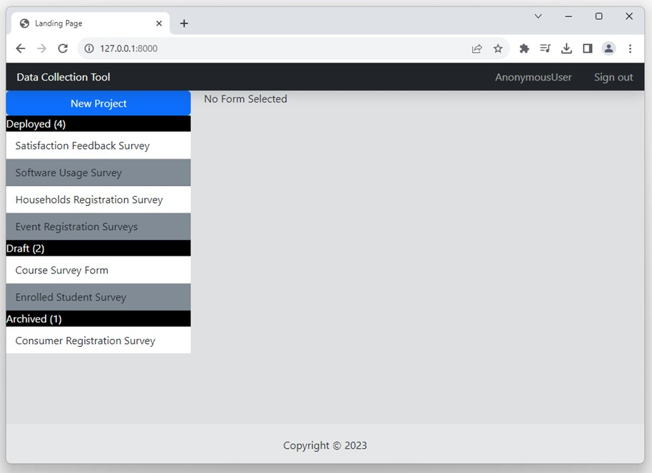
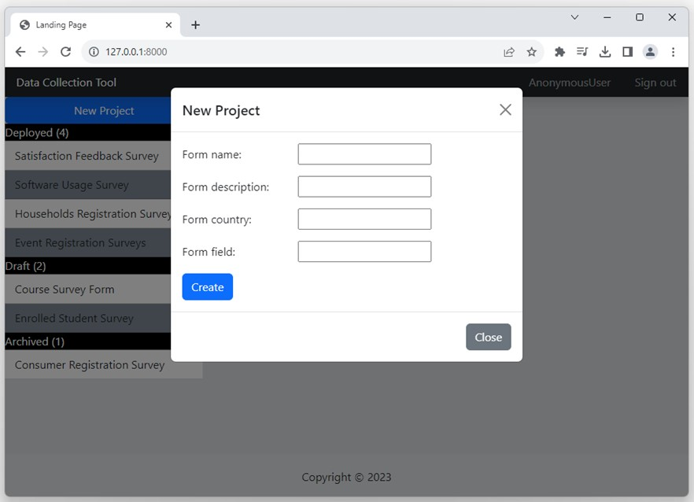
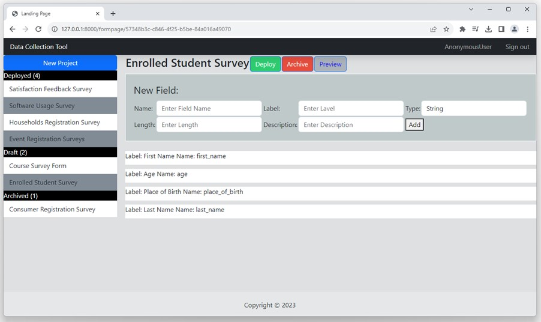
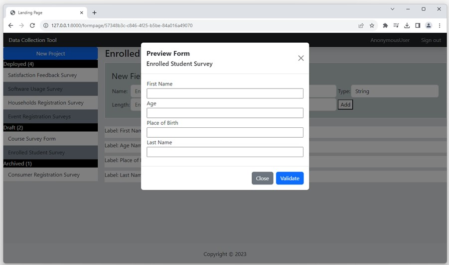
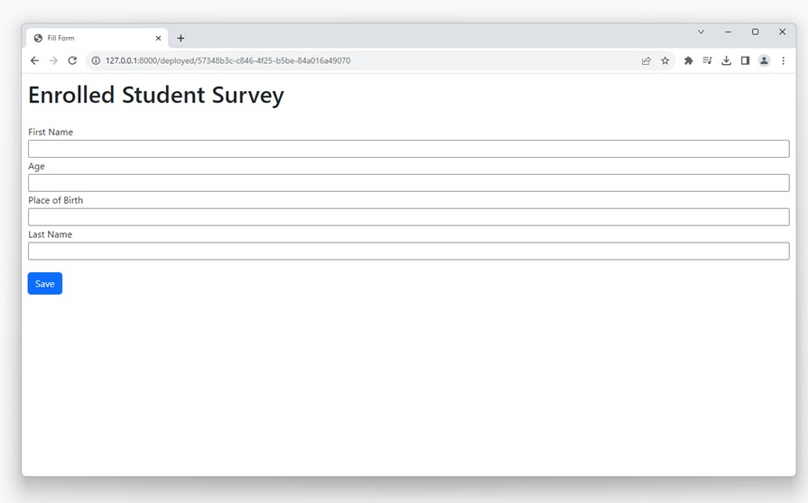

# Data Collection Tool
This project aim to demostrate how Data Collection Tool webpage can be developed using Python + Django.

Home page has list of all projects created: Deployed, Draft or Archived. Also has button to create new project.

To create new project, click button 'New Project' and fill the form

After form is created, you can add columns to the project (form)

After add columns you can preview the form

If everything is ok, you can deploy project by click on button 'Deploy'. Click the link provided above to find link to share for filling form.

## To run the project

Type in commandline

### `py manage.py runserver`

Server will be running on [http://127.0.0.1:8000]